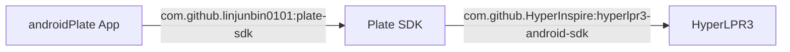

# Plate SDK

轻量 Android 车牌识别 SDK，封装 [HyperLPR3](https://github.com/HyperInspire/hyperlpr3-android-sdk)。

> **bitmap 进去，车牌号 + 坐标出来。**

## 安装

### 1. 添加 JitPack 仓库

`settings.gradle.kts`：

```kotlin
dependencyResolutionManagement {
    repositories {
        // ... 其他仓库
        maven { url = uri("https://jitpack.io") }
    }
}
```

### 2. 添加依赖

```kotlin
// app/build.gradle.kts
dependencies {
    implementation("com.github.linjunbin0101:plate-sdk:1.0.0")
}
```

## 快速开始

```kotlin
import com.zkc.plate.PlateConfig
import com.zkc.plate.PlateRecognizer

// 初始化（只需一次，通常在 Application 或 Activity 中）
PlateRecognizer.init(context)

// 识别（默认自动旋转重试，无需处理 bitmap 方向）
val bitmap: Bitmap = ...
val plates: List<PlateResult> = PlateRecognizer.getInstance().recognize(bitmap)

plates.forEach { plate ->
    Log.i("Plate", "车牌: ${plate.number}, 置信度: ${plate.confidence}")
    Log.i("Plate", "坐标: [${plate.x1}, ${plate.y1}, ${plate.x2}, ${plate.y2}]")
}
```

## 返回结果

`recognize()` 返回 `List<PlateResult>`：

| 字段 | 类型 | 说明 |
|------|------|------|
| `number` | `String` | 车牌号（如 `"粤A12345"`） |
| `confidence` | `Float` | 识别置信度（0.0 ~ 1.0） |
| `type` | `Int` | 车牌类型编码，见下方对照表 |
| `x1, y1` | `Float` | 车牌矩形框左上角坐标 |
| `x2, y2` | `Float` | 车牌矩形框右下角坐标 |

> 坐标始终位于**原始输入 bitmap** 的坐标系内，已自动处理内部缩放和旋转重试的坐标映射。

### 车牌类型编码

| type | 含义 |
|------|------|
| `-1` | 未知 |
| `0` | 蓝牌 |
| `1` | 黄牌（单层） |
| `2` | 白牌（单层） |
| `3` | 绿牌（新能源） |
| `4` | 黑牌（港澳） |
| `5~8` | 香港/澳门（单层/双层） |
| `9` | 黄牌（双层） |

## 配置

所有参数都有默认值，按需覆盖：

```kotlin
PlateRecognizer.init(context, PlateConfig(
    detectionLevel       = HyperLPR3.DETECT_LEVEL_HIGH,   // 默认 HIGH
    maxPlates            = 5,                              // 默认 5
    confidenceThreshold  = 0.7f,                           // 默认 0.7
    roiImageWidth        = 640,                            // 默认 640
    enableRotationRetry  = true,                           // 默认 true
))
```

| 参数 | 类型 | 默认值 | 说明 |
|------|------|--------|------|
| `detectionLevel` | `Int` | `DETECT_LEVEL_HIGH` | 检测灵敏度：`LOW` / `MEDIUM` / `HIGH` |
| `maxPlates` | `Int` | `5` | 单张图最多返回几块车牌 |
| `confidenceThreshold` | `Float` | `0.7` | 置信度阈值（0 ~ 1），越高越严格 |
| `roiImageWidth` | `Int` | `640` | 识别前图片缩放宽，值越小越快但可能影响精度 |
| `enableRotationRetry` | `Boolean` | `true` | 识别不到时自动旋转 90°/180°/270° 重试 |

## 注意事项

1. **bitmap 方向**：默认已启用旋转重试（`enableRotationRetry = true`），传入任意方向的 bitmap 均可自动尝试识别。若需关闭可设为 `false`。
2. **坐标**：返回的坐标始终在原始输入 bitmap 坐标系内，可直接用于 `Canvas.drawRect()` 绘制边框。
3. **初始化**：`PlateRecognizer.init()` 只需调用一次，重复调用返回已有实例。
4. **线程安全**：`recognize()` 可在任意线程调用。
5. **内存**：每次 `recognize()` 内部会缩放 bitmap，原图不受影响。旋转重试产生的临时 bitmap 用完即释放。

## 完整示例

```kotlin
import android.graphics.Canvas
import android.graphics.Color
import android.graphics.Paint

class MyActivity : ComponentActivity() {
    override fun onCreate(savedInstanceState: Bundle?) {
        super.onCreate(savedInstanceState)

        // 初始化
        PlateRecognizer.init(this, PlateConfig(
            maxPlates = 3,
            confidenceThreshold = 0.8f,
        ))

        // 拍照后识别
        takePhoto { bitmap ->
            val plates = PlateRecognizer.getInstance().recognize(bitmap)
            if (plates.isNotEmpty()) {
                plates.forEach { plate ->
                    Log.i("Plate", "车牌: ${plate.number} 置信度: ${plate.confidence}")
                    Log.i("Plate", "坐标: [${plate.x1},${plate.y1},${plate.x2},${plate.y2}]")
                }
                // 在原图上画框
                drawBoxes(bitmap, plates)
            } else {
                Log.w("Plate", "未识别到车牌")
            }
        }
    }

    private fun drawBoxes(bitmap: Bitmap, plates: List<PlateResult>) {
        val canvas = Canvas(bitmap)
        val paint = Paint().apply {
            color = Color.RED
            style = Paint.Style.STROKE
            strokeWidth = 4f
        }
        plates.forEach { plate ->
            canvas.drawRect(plate.x1, plate.y1, plate.x2, plate.y2, paint)
        }
    }
}
```

## 开发者指南

### 项目结构

```
plate-sdk/
├── lib/                          # SDK 库模块
│   ├── build.gradle.kts          # 库模块构建配置
│   └── src/main/java/com/zkc/plate/
│       ├── PlateConfig.kt        # 配置数据类
│       ├── PlateRecognizer.kt    # 核心识别逻辑
│       └── PlateResult.kt        # 识别结果（含坐标）
├── build.gradle.kts              # 根构建文件
├── settings.gradle.kts           # 模块声明
├── jitpack.yml                   # JitPack 构建指令
└── README.md
```

### 本地开发

```bash
# 编译验证
./gradlew :lib:assembleRelease

# 发布到本地 Maven（调试用）
./gradlew :lib:publishToMavenLocal
```

### 发布新版本

1. 修改 `lib/build.gradle.kts` 中的 `version`（如果需要调整版本号）
2. 提交代码并推送到 GitHub：
   ```bash
   git add .
   git commit -m "描述你的改动"
   git push
   ```
3. 打新标签并推送：
   ```bash
   git tag 1.0.1
   git push --tags
   ```
4. JitPack 会自动检测新 tag 并开始构建，完成后即可在 `https://jitpack.io/#linjunbin0101/plate-sdk` 看到新版本

### 依赖关系



- **HyperLPR3**：底层车牌识别引擎，SDK 的唯一外部依赖
- **Plate SDK**：对 HyperLPR3 的轻量封装，提供简洁的单例 API
- **androidPlate App**：最终消费方，通过 JitPack 引入 SDK
