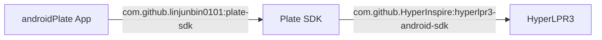

# Plate SDK

轻量 Android 车牌识别 SDK，封装 [HyperLPR3](https://github.com/HyperInspire/hyperlpr3-android-sdk)。

> **bitmap 进去，车牌号出来。**

## 安装

### 1. 添加 JitPack 仓库

`settings.gradle.kts`：

```kotlin
dependencyResolutionManagement {
    repositories {
        // ... 其他仓库
        maven { url = uri("https://jitpack.io") }
    }
}
```

### 2. 添加依赖

```kotlin
// app/build.gradle.kts
dependencies {
    implementation("com.github.linjunbin0101:plate-sdk:1.0.0")
}
```

## 快速开始

```kotlin
import com.zkc.plate.PlateConfig
import com.zkc.plate.PlateRecognizer

// 初始化（只需一次，通常在 Application 或 Activity 中）
PlateRecognizer.init(context)

// 识别
val bitmap: Bitmap = ...  // 确保已旋转到正向
val plates: List<String> = PlateRecognizer.getInstance().recognize(bitmap)
// plates = ["粤A12345", "京B67890"]
```

## 配置

所有参数都有默认值，按需覆盖：

```kotlin
PlateRecognizer.init(context, PlateConfig(
    detectionLevel       = HyperLPR3.DETECT_LEVEL_HIGH,   // 默认 HIGH
    maxPlates            = 5,                              // 默认 5
    confidenceThreshold  = 0.7f,                           // 默认 0.7
    roiImageWidth        = 640,                            // 默认 640
))
```

| 参数 | 类型 | 默认值 | 说明 |
|------|------|--------|------|
| `detectionLevel` | `Int` | `DETECT_LEVEL_HIGH` | 检测灵敏度：`LOW` / `MEDIUM` / `HIGH` |
| `maxPlates` | `Int` | `5` | 单张图最多返回几块车牌 |
| `confidenceThreshold` | `Float` | `0.7` | 置信度阈值（0 ~ 1），越高越严格 |
| `roiImageWidth` | `Int` | `640` | 识别前图片缩放宽，值越小越快但可能影响精度 |

## 注意事项

1. **bitmap 方向**：传入的 bitmap 必须已旋转到正向（`rotationDegrees` = 0），SDK 内部不做旋转处理。
2. **初始化**：`PlateRecognizer.init()` 只需调用一次，重复调用返回已有实例。
3. **线程安全**：`recognize()` 可在任意线程调用。
4. **内存**：每次 `recognize()` 内部会缩放 bitmap，原图不受影响。

## 完整示例

```kotlin
class MyActivity : ComponentActivity() {
    override fun onCreate(savedInstanceState: Bundle?) {
        super.onCreate(savedInstanceState)

        // 初始化
        PlateRecognizer.init(this, PlateConfig(
            maxPlates = 3,
            confidenceThreshold = 0.8f,
        ))

        // 拍照后识别
        takePhoto { bitmap ->
            val plates = PlateRecognizer.getInstance().recognize(bitmap)
            if (plates.isNotEmpty()) {
                // 识别成功
                Log.i("Plate", "识别到 ${plates.size} 块车牌: $plates")
            } else {
                // 未识别到
                Log.w("Plate", "未识别到车牌")
            }
        }
    }
}
```

## 开发者指南

### 项目结构

```
plate-sdk/
├── lib/                          # SDK 库模块
│   ├── build.gradle.kts          # 库模块构建配置
│   └── src/main/java/com/zkc/plate/
│       ├── PlateConfig.kt        # 配置数据类
│       └── PlateRecognizer.kt    # 核心识别逻辑
├── build.gradle.kts              # 根构建文件
├── settings.gradle.kts           # 模块声明
├── jitpack.yml                   # JitPack 构建指令
└── README.md
```

### 本地开发

```bash
# 编译验证
./gradlew :lib:assembleRelease

# 发布到本地 Maven（调试用）
./gradlew :lib:publishToMavenLocal
```

### 发布新版本

1. 修改 `lib/build.gradle.kts` 中的 `version`（如果需要调整版本号）
2. 提交代码并推送到 GitHub：
   ```bash
   git add .
   git commit -m "描述你的改动"
   git push
   ```
3. 打新标签并推送：
   ```bash
   git tag 1.0.1
   git push --tags
   ```
4. JitPack 会自动检测新 tag 并开始构建，完成后即可在 `https://jitpack.io/#linjunbin0101/plate-sdk` 看到新版本

### 依赖关系



- **HyperLPR3**：底层车牌识别引擎，SDK 的唯一外部依赖
- **Plate SDK**：对 HyperLPR3 的轻量封装，提供简洁的单例 API
- **androidPlate App**：最终消费方，通过 JitPack 引入 SDK
